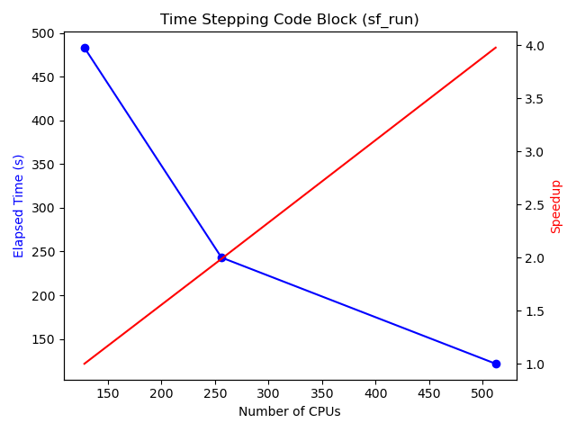

# LIS Profiling and Performance Analysis

## With ESMF TRACE

### Overview

The ESMF tracing tool records detailed timing information for all phases of all ESMF components executing in an application for later analysis. Trace analysis can be used to understand what happened during a program's execution and is often used for diagnosing problems, debugging, and performance analysis.

To exercise tracing in LIS, the following two calls have been placed around specific regions of the code:

       call ESMF_TraceRegionEnter(region_name)
            Record an event in the trace for this PET indicating entry into a user-defined region with the given name.
       call ESMF_TraceRegionExit(region_name)
            Record an event in the trace for this PET indicating exit from a user-defined region with the given name.
       
       

### Compilation

Before you compile the code, set the environment variable `ESMF_TRACE` to 1:

     setenv ESMF_TRACE 1

The calls related to the profiling of sections of the code will be included in the compilation process.

### Run Time

**ESMF tracing is disabled by default.** To enable tracing, set the `ESMF_RUNTIME_TRACE` environment variable to `ON`. You do not need to recompile your code to enable tracing.

       setenv ESMF_RUNTIME_TRACE ON

The default behavior is to trace all PETs of the ESMF application. Tracing can produce an extremely large number of events depending on the total number of PETs and the length of the run. To reduce output, it is possible to restrict the PETs that produce trace output by setting the `ESMF_RUNTIME_TRACE_PETLIST` environment variable.

       # Only trace PETs 0, 20, and 35 through 39
       #setenv ESMF_RUNTIME_TRACE_PETLIST "0 20 35-39"

`phase_enter` and `phase_exit` events are automatically be recorded for all `Initialize`, `Run`, and `Finalize` phases of all Components in the application. To trace only user-instrumented regions (via the `ESMF_TraceRegionEnter()` and `ESMF_TraceRegionExit()` calls), Component-level tracing can be turned off by setting:

       setenv ESMF_RUNTIME_TRACE_COMPONENT OFF
              
Trace events are flushed to file at a regular interval. If the application crashes, some of the most recent events may not be flushed to file. To maximize the number of events appearing in the trace, an option is available to flush events to file more frequently. Because this option may have negative performance implications due to increased file I/O, it is not recommended unless needed. To turn on eager flushing use:
       
       setenv ESMF_RUNTIME_TRACE_FLUSH EAGER

### Analyzing the Profiling Outputs

After running an ESMF application with tracing enabled, a directory called `traceout` will be created in the run directory and it will contain a metadata file and an event stream file `esmf_stream_XXXX` for each PET with tracing enabled. Together these files form a valid [Common Trace Format](https://diamon.org/ctf/) (CTF) trace which may be analyzed with any of the tools listed above.

## With LIS_ftiming Module

The LIS_ftiming Module is an MPI based tool containing subroutines that allow users to measure the time to run regions of the code. 
It produces the following timing statistics: 

- The overall min/max/mean times require to run each selected region of the code.
- For each processor, the min/max/mean times require to run each selected region
- For each selected region, the execution times on all processors

These  statistics are useful for analyzing load imbalances.

### Source Code Modifications

The LIS_ftiming tool is contained in the module file `LIS_ftimingMod.F90` that resides in the `core/` directory. It consists on four main subroutines:

- `Ftiming_init`: Called once to initialize the tool
- `Ftiming_On`/`Ftiming_Off`: Called to turn on/off the time measurement at specific regions of the code.
- `Ftiming_Output`: Subroutine to gather all timing numbers and produce a timing statistics text file.

We introduced a logical variable `LIS_rc%do_ftiming` to exercise the tool at run time. 
The following statements were added around each region of interest:

        if (LIS_rc%do_ftiming) call Ftiming_On(block_name)
           CODE BLOCK
        if (LIS_rc%do_ftiming) call Ftiming_Off(block_name)

Every time the area of interest is covers during the run, the profiling tool will measure the elapsed time to execute it.

### Run Time Setting

To turn on the tool, we need to add the following line in the `lis.config` file:

        Profiling Tool: yes
   
### Sample Output

In the initial use of the profiling tool, we collected timing statistics of code blocks that encompass
initialization procedures, time stepping and producing history (writing data files).
We wanted to first identify the most time consuming components and also the ones showing the most
load imbalance.

The timing statistics below show the overall minimum/maximum/average times it took to to run 
specific sections of the code with a 16x16 procesor decomposition (256 cores) for a two-day integeration. 
There are two main blocks, `LIS_init` and `LIS_run`, and all the others fall within them.

      -----------------------------------------------------------------
           Block                       Min Time    Max Time    Avg Time
      -----------------------------------------------------------------
        LIS_init                        66.9860     69.0852     67.9283
        dom_init                        17.2476     17.3603     17.3086
        dom_quilt                        0.0028      0.1462      0.0626
        soils_init                       3.1929      3.4084      3.3168
        dom_setup                        2.0920      3.1094      2.6521
        param_init                      12.2926     12.7837     12.6170
        green_setup                      6.3572      6.6997      6.5452
        rough_setup                      0.0001      0.0002      0.0001
        emiss_setup                      0.0000      0.0000      0.0000
        alb_setup                        5.8863      6.3137      6.0716
        lai_setup                        0.0000      0.0000      0.0000
        sai_setup                        0.0000      0.0005      0.0000
        sf_init                          0.0087      0.1143      0.0797
        lsm_init                         0.0086      0.1142      0.0796
        metf_init                        0.1842      0.2972      0.2106
        DA_init                          0.0000      0.0002      0.0000
        sf_setup                        36.9808     38.6601     37.6763
        lsm_setup                       36.9808     38.6601     37.6763
        sf_readrst                       0.0000      0.0565      0.0357
        lsm_readrst                      0.0000      0.0565      0.0357
        rtm_init                         0.0000      0.0000      0.0000
        appMod_init                      0.0000      0.0002      0.0001
        LIS_run                       4440.9501   4443.0569   4442.1115
        param_dynsetup                  11.6908     13.2312     12.5341
        green_read                       6.0883      6.4517      6.2574
        emiss_read                       0.0001      0.0002      0.0001
        alb_read                         5.5073      6.0749      5.7572
        lai_read                         0.0001      0.0002      0.0001
        sai_read                         0.0001      0.0002      0.0001
        lsm_dynsetup                     0.0002      0.0006      0.0003
        soils_diag                       0.0002      0.1548      0.0810
        green_diag                       0.0002      0.0004      0.0002
        emiss_diag                       0.0001      0.0002      0.0001
        rough_diag                       0.0001      0.0002      0.0001
        lai_diag                         0.0001      0.0002      0.0001
        sai_diag                         0.0001      0.0002      0.0001
        alb_diag                         0.0001      0.3347      0.2217
        metf_get                        14.4921     30.1865     23.0301
        metf_perturb                     0.0026      1.0837      0.7558
        sf_f2t                           0.0020      0.8358      0.3696
        lsm_f2t                          0.0019      0.8352      0.3693
        sf_run                           0.0020    407.1130    247.2083
        lsm_run                          0.0018    407.1126    247.2080
        sf_perturb                       0.0003      0.0242      0.0004
        lsm_perturb                      0.0001      0.0001      0.0001
        DA_run                           0.0001      0.0001      0.0001
        DA_out                           0.0001      0.0002      0.0001
        sf_output                       39.5128   4113.0237   2897.8900
        sf_writerst                      0.0022    297.8989    247.1645
        lsm_writerst                     0.0020    297.8987    247.1642
        rtm_run                          0.0001      0.0002      0.0002
        rtm_out                          0.0001      0.0001      0.0001
        appMod_run                       0.0001      0.0001      0.0001
        appMod_out                       0.0001      0.0001      0.0001

From the above table, we can make few observations:

- The time required for initialization procedures (`LIS_init`) is not a concern. We did additional runs where we vary the number of cores (64, 128, 512) and we found out that the initialization times pretty much remain the same.
- The time for calculations (the `sf_run` code block) accounts for less than 10% of the overall time. Further runs with different number of cores show a scaling well beyond 512 cores. We concluded that time stepping done in `sf_run` is not an area of concern (see figure below).
- The obvious time consuming and load imbalance code block is the one performing the writing of data in netCDF-4 files: `sf_output`. 

The remaining part of our work is to determine how we can significantly reduce the time it takes to execute `sf_output`
and how we can make it scale across beyond 1000 cores.
We needed to carry out a finer profiling of `sf_output` by identifying it subcomponents.
Writing data in files involve at least three basic processes:

- **Data Preparation** (`sf_output/prep`): This includes all the necessary steps (mapping data from 2D to 1D or the opposit, etc.) to prepare the data before they are ready to be sent or written out.
- **Data Gathering** (`sf_output/gather`): all the cores send their portion of the data to the root core. the LIS code, this is done through MPI_GATHERV calls.
- **Data Dump** (`sf_output/write`): The root core writes the global data to output files. During this stage, the other core have to wait till the root is done before proceeding to the next task.

We did one more experiment and obtained the following statistics:

      -----------------------------------------------------------------
           Block                       Min Time    Max Time    Avg Time
      -----------------------------------------------------------------
        wrt/sf_output                   31.0142   4190.8978   2970.2978
        wrt/sf_output/write              0.0002   3463.9228     13.5315
        wrt/sf_output/prep               0.5820    413.7532    115.9073
        wrt/sf_output/gather             0.0005   3342.4777   2839.6233

The time spent in `sf_output/prep` is fairly small and we were able to verify that this particular area of the code continues to scale.
When the root core receives all the necessary information, the time to dump data is pretty mich the same regardless of the number of CPUs used.
This leads us to the Data Gathering process that deals with communications to the root processor.
Improving the parallel performance of the LIS code requires the reduction of the amount of communications needed to produce outputs.

### Effect of Data Compression

Before we start exploring options the reduce and scale the time spent in output procedures,
we need to first exhaust all improvement possibilities with the current version of the LIS code.
The default data compression level was 9 (highest used by netCDF4). 
The higher the level, the more time it takes to compress the data.
We tried to profile the output section of the code as function of the data compression level (9, 3 and 1).
The results below show that the elapsed time significantly decreases when we reduce the compression level.
From level 9 to level 1, we decrease the average time by at least an order of magnitude (10 times)
while reducing the file sizes by a factor of less than 1.10.
We concluded that the compression level of 1 is more appropriate for time and disc management.

**Compression Level 9:**

| CPUs | Block   | Min Time |  Max Time |  Avg Time |
| :--- | :--- | ---: | ---: | ---: |
| **128** |  | | | |
| | wrt/sf_output        | 3223.1213 | 4532.1582  | 3489.7110 |
| | wrt/sf_output/write  | 0.0003    | 3696.3498  |  28.8784 |
| | wrt/sf_output/prep   | 1.3318    | 824.0970   | 234.2953 |
| | wrt/sf_output/gather | 11.6957   | 3325.1255  | 3226.4690 |
| **256** |  | | | |
| | wrt/sf_output        | 31.0142   | 4190.8978  | 2970.2978 |
| | wrt/sf_output/write  | 0.0002    | 3463.9228  |   13.5315 |
| | wrt/sf_output/prep   | 0.5820    |  413.7532  |  115.9073 |
| | wrt/sf_output/gather | 0.0005    | 3342.4777  | 2839.6233 |

**Compression Level 3:**

| CPUs | Block   | Min Time |  Max Time |  Avg Time |
| :--- | :--- | ---: | ---: | ---: |
| **128** |  | | | |
| | wrt/sf_output        | 1.2740  | 1267.4710 | 263.3622 |
| | wrt/sf_output/write  | 0.0002  |  437.3784 |   3.4175 |
| | wrt/sf_output/prep   | 1.1748  |  818.3115 | 239.5731 |
| | wrt/sf_output/gather | 0.0007  |  474.6096 |  20.3239 |

**Compression Level 1:**

| CPUs | Block   | Min Time |  Max Time |  Avg Time |
| :--- | :--- | ---: | ---: | ---: |
| **128** |  | | | |
| |  wrt/sf_output        |  1.2766  |  1348.0326 |  269.6079 |
| |  wrt/sf_output/write  |  0.0003  |  508.4471  |  3.9729 |
| |  wrt/sf_output/prep   |  0.0011  |  821.7192  |  240.0488 |
| |  wrt/sf_output/gather |  0.0007  |  569.8330  |   24.6224 |
| **256** |  | | | |
| |  wrt/sf_output        |  0.5536  |  786.0248  |  138.6930 |
| |  wrt/sf_output/write  |  0.0003  |  358.5394  |  1.4010 |
| |  wrt/sf_output/prep   |  0.0012  |  409.8312  |  115.3306 |
| |  wrt/sf_output/gather |  0.0008  |  390.0956  |  21.5385 |
| **512** |  | | | |
| |  wrt/sf_output        |  0.0039  |  584.8298  |  35.4417 |
| |  wrt/sf_output/write  |  0.0002  |  358.3871  |  0.7003 |
| |  wrt/sf_output/prep   |  0.0004  |  208.7223  |  10.2215 |
| |  wrt/sf_output/gather |  0.0008  |  546.5432  | 24.3946 |

## Exploring I/O Options

We wrote standalone Fortran/MPI codes to explore different I/O options for writting out netCDF-4 files:

- **Option 1**: one processor is in charge of collecting the data and writing the data into a single file.
- **Option 2**: We use parallel netCDF-4 to allow each processor to write its portion of the data into a single file.
- **Option 3**: We introduce I/O servers where a set of nodes are grouped together and they cover a specific subdomain (I/O domain). Within one group, one processor is in charge of collecting the data from other processors in the group and writing the data to its own file.

The figure below helps us understand the three options.
We have 36 nodes (0, 1, 2, ..., 35) and each of them covers one subdomain (black square, computational domain for the corresponding node). 
In Option 1, the root processor is in Node 0 and is responsible for gathering subarrays across processors from all nodes and writting out the data.
In Option 2, all the individual cores in each nodes will write the data in parallel into a single file.
Finally, in Option 3, the global domain is subdivided into I/O domains (yellow borders) that will be handled by a group of nodes.
Within that group of nodes, one core is in charge of performing the write operations. 
Communications occur only within the group of nodes.

- In **Option 1**, all the available cores communicate with the root one.  The root core has to finish serially writing the global data into the file before all the cores proceeed with the calculations.  This method requires either an expensive collective operation and the storage of the entire field into memory or a separation of the work into a sequence of multiple potentially expensive collectives and I/O writes.
- In **Option 2**, all cores are allowed to directly write to a single shared file.  Here, the I/O operations are parallelized but this can require an increasing number of concurrent I/O operations, which can produce an abnormal load on the OS and its target filesystems when such a model is distributed over thousands of cores.  There are also contention issues associated with the writing of the data itself.
- For **Option 3**, within each I/O domain, one core is nominated to be responsible for the gathering and writing of data. This has the effect of reducing the number of I/O processes to the number of I/O domains, while still permitting some degree of scalability from the concurrent I/O.

The following table summarizes the basic features of each option.

| Option | Write Pattern | Number of files | Number of cores communicating |
| ---    | --- |  --- | --- |
| 1      | single-threaded, single file | 1 | All |
| 2      | Parallel I/O, single shared file | 1 | None |
| 3      | Distributed I/O, single file per I/O domain | I/O domains | max of number of cores in one I/O domain |

Option 1

Option 2

Option 3

### More on the I/O Server Concept
Here, we use the following settings:

- **NX**: number of cores along the x-direction is a multiple of the number of cores per node.
- **NY**: number of cores along the y-direction is the number of layers/layers of nodes.

Basically, with NX, we can determine how many nodes we have along the x-direction and NY will be the number of layers of group of nodes (along x-direction) are avavailable.
 
We can select any arbitrary number of I/O servers along the x-direction (nxio) and the y-direction (nyio). 
**nxio** is a factor of NX/(num of cores per node) and **nyio** is a factor of NX.

If for instance we use 36 Haswell nodes on discover, we can have: NX = 252 (28 times 9) and NY = 4. 
We can see the NXxNY decomposition as 4 stacks (layers on the y-direction) of 9 nodes (on the x-direction) per layer. 
We have several options for the I/O servers (based on the number of nodes):
 
| Number of I/O Servers | nxio | nyio | Comments |
| --- | --- | --- | --- |
| 36   |  9  |  4  | Each node has its own io server |
| 18   |  9  |  2  |  |
| 12   |  3  |  4  |  |
| 9   |  9  |  1  | Domain decomposition along the x-axis only  |
| 6  |  3  |  2  | Shown in the `Compute and I/O domain decomposition` figure |
| 4  |  1  |  4  |  |
| 3  |  3  |  1  |  |
| 2  |  1  |  2  |  |
| 1  |  1  |  1  | All the cores communicate with the root CPU. |

### Few Results

We want to use the three options to write out an array of size 2 Gb in netCDF-4 files.
We measure the total time it takes to open the file(s), declare the variable, 
gather the data (if necessary) and write out the array.
We vary the number of nodes from 1 to 6. 
In Option 3, there is one I/O server per node.

We can also record the bandwith as shown in the figure:

In the above experiment, inter-processor communications for Option 3 were were intra nodes only and did not involve the network.
Basiscally, the time needed by the I/O server to gather the data is minimal.
The question is what happens if I/O domains have more than one node.
In a new experiment, we consider NX = 224 (8 nodes) and NY = 1. 
We write out the 2Gb array when nxio is equal to 1, 2, 4, 8. 
Note than nyio = 1 in all the cases because NY = 1.

| nxio | Total Time (s) | Time to Gather (s) | Data per I/O Domain (Gb) |Bandwith for Gather (Gb/s) |
| ---  | ---        | ---            |          --- | --- |
| 8    |  1.0753    | 0.0893  | 0.25 | 2.80 |
| 4    |  2.0675    | 0.1420  | 0.50 | 3.52 |
| 2    |  4.0514    | 0.2554  | 1.00 | 3.91 |
| 1    |  8.0100    | 0.4441  | 2.00 | 4.50 |

### Another Option

We can expend Option by allowing allow the I/O servers to write in a single shared file.
The write process will be done in parallel.
We will still have the contention issue but we will consisder a limited number of I/O servers (4 to 6)
to alleviate any possible bottleneck.

Option 4

The advantage of this option is that we will no longer have to post-process the files as in Option 3.

### Reference Document

- [ESMF Profiling and Tracing](http://www.earthsystemmodeling.org/esmf_releases/last_built/ESMF_refdoc/node6.html#SECTION060130000000000000000)
- [Parallel I\O in Flexible Modelling System (FMS) and Modular Ocean Model 5 (MOM5)](https://doi.org/10.5194/gmd-13-1885-2020)
- [Introduction to HPC Parallel I/O](https://ideas-productivity.org/wordpress/wp-content/uploads/2018/03/webinar006-2016_HPC_IO_Intro.pdf)
- [Parallel I/O in Practice](http://www.eecs.ucf.edu/~jwang/Teaching/EEL6760-f13/M02.tutorial.pdf)
